---
## Author
author:
  name: Сингх Ааруши
  degrees: DSc
  orcid: 0000-0002-0877-7063
  email: 1132215095@rudn.ru
  affiliation:
    - name: Российский университет дружбы народов
      country: Российская Федерация
      postal-code: 117198
      city: Москва
      address: ул. Миклухо-Маклая, д. 6

## Title
title: "отчёта по лабораторной работе № 1"
subtitle: "Подготовка стенда"
license: "CC BY"
---

# Цель работы

Освоить методологию организации научных проектов в среде Julia с использованием пакета DrWatson, принципы литературного программирования (Literate.jl) и инструменты контроля версий (git, GitFlow). 
На примере модели экспоненциального роста научиться проводить вычислительные эксперименты, параметрические исследования, автоматически генерировать отчёты (Quarto, Jupyter) и интегрировать результаты в итоговый документ.

# Задание

1. **Подготовка рабочего пространства**  
   - Создать иерархию каталогов в соответствии с соглашением Denote.  
   - Инициализировать репозиторий курса по шаблону, настроить git и GitFlow.  
   - Сгенерировать SSH- и PGP-ключи, настроить подпись коммитов.

2. **Создание проекта DrWatson**  
   - В каталоге лабораторной работы (`labs/lab01`) инициализировать проект DrWatson.  
   - Установить необходимые пакеты: `DifferentialEquations`, `Plots`, `DataFrames`, `Literate`, `JLD2`, `Quarto` и др.  
   - Проверить работоспособность окружения тестовым скриптом.

3. **Реализация модели экспоненциального роста**  
   - Написать скрипт, решающий уравнение `du/dt = α·u` с заданными начальными условиями.  
   - Построить график решения, вычислить время удвоения.  
   - Оформить скрипт в стиле литературного программирования (файл `.jl` с Markdown-комментариями).

4. **Генерация производных форматов**  
   - С помощью `Literate.jl` получить из литературного скрипта:  
     * чистый код (`.jl`);  
     * Jupyter Notebook (`.ipynb`);  
     * документ Quarto (`.qmd`).  
   - Выполнить код в Jupyter и убедиться в его работоспособности.

5. **Параметрическое исследование**  
   - Модифицировать скрипт для запуска серии экспериментов с разными значениями параметра α.  
   - Использовать `produce_or_load` для кэширования результатов.  
   - Собрать все результаты в таблицу, построить сравнительные графики.  
   - Провести бенчмаркинг для различных α.

6. **Интеграция в отчёт**  
   - Включить сгенерированный Quarto-документ в основной отчёт через ``.  
   - Настроить `_quarto.yml` и преамбулу для корректной компиляции с кодом Julia.  
   - Скомпилировать итоговый отчёт.

7. **Фиксация изменений**  
   - Выполнить коммиты с использованием стандарта Conventional Commits.  
   - Соблюдать семантическое версионирование.  
   - Отправить результаты в удалённый репозиторий.

# Теоретическое введение

Модель экспоненциального роста описывается обыкновенным дифференциальным уравнением  
величина популяции (капитала, числа заражённых) в момент времени t, alpha– константа скорости роста. Аналитическое решение имеет вид u(t) = 𝑢0𝑒^𝛼𝑡. Характерное время удвоения  не зависит от начального значения. Модель применима в биологии, финансах, эпидемиологии на начальных этапах, когда ограничения ещё несущественны. В реальности из-за ограниченности ресурсов рост переходит в логистический. В работе модель реализуется численно с использованием метода Цыто́в‑5 (`Tsit5`) из пакета `DifferentialEquations.jl`.

# Выполнение лабораторной работы
1. **Настройка окружения** – устанавливается необходимое ПО, создаются ключи, настраиваются git, GitFlow и рабочее пространство согласно шаблону.
   
   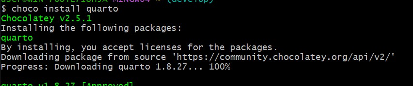{#fig-001 width=70%}

   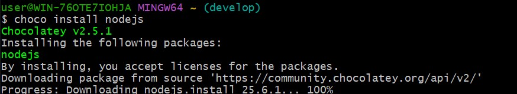{#fig-001 width=70%}

   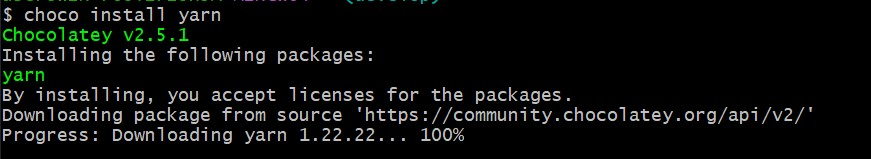{#fig-001 width=70%}

   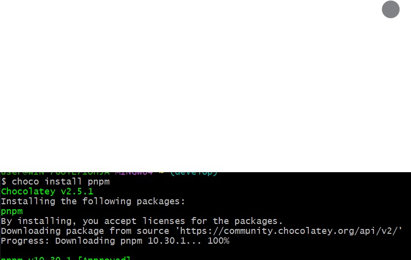{#fig-001 width=70%}

   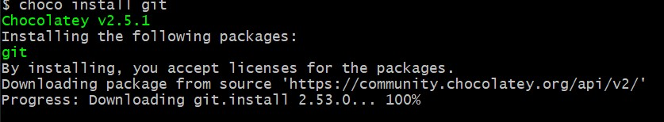{#fig-001 width=70%}

2. **Создание проекта DrWatson** – в каталоге `labs/lab01` выполняется инициализация проекта, активация окружения, установка пакетов.  

3. **Разработка базового скрипта** – пишется функция `exponential_growth!`, задаются параметры, решается ОДУ, строится график. 
    
   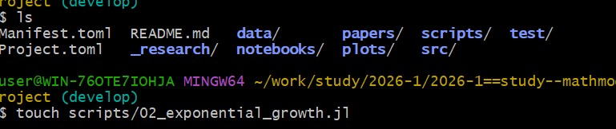{#fig-001 width=70%} 
    
   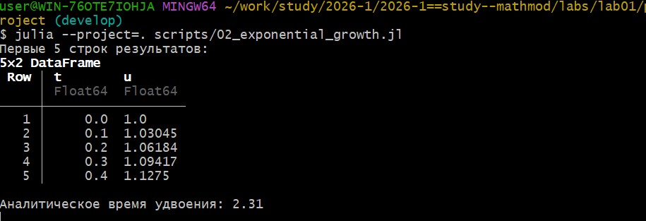{#fig-001 width=70%} 
   
   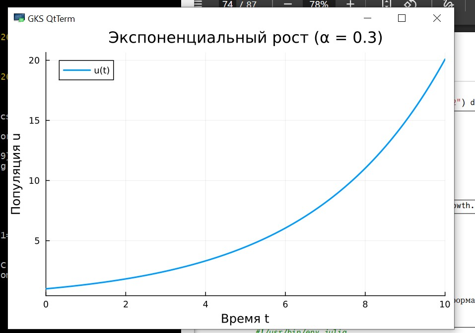{#fig-001 width=70%} 
   
   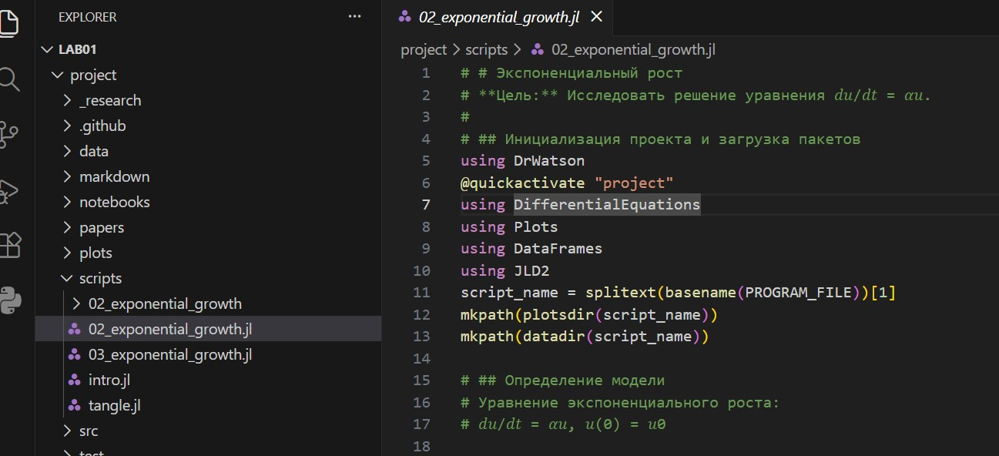{#fig-001 width=70%} 
   
   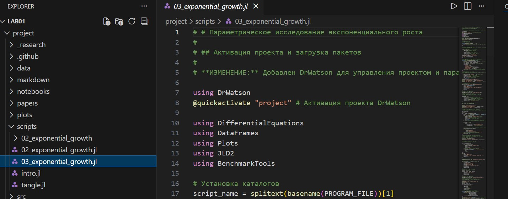{#fig-001 width=70%} 

4. **Литературное оформление** – скрипт дополняется Markdown-комментариями.  

5. **Генерация отчётов** – с помощью `Literate.jl` создаются чистый код, Jupyter Notebook (VS Studio) и Quarto-документ (скрипт `tangle.jl`).  
    
   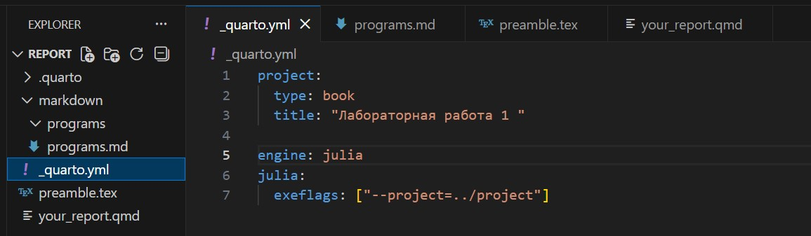{#fig-001 width=70%} 
    
   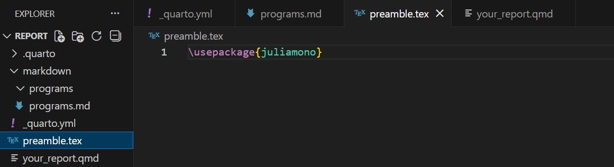{#fig-001 width=70%} 
    
   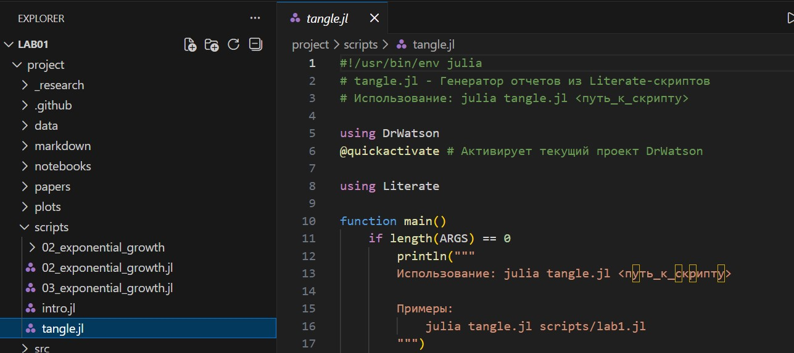{#fig-001 width=70%} 

6. **Параметрическое сканирование** – модифицируется скрипт для перебора α, используются `dict_list`, `produce_or_load`, сохраняются сводные таблицы и графики.  
     
   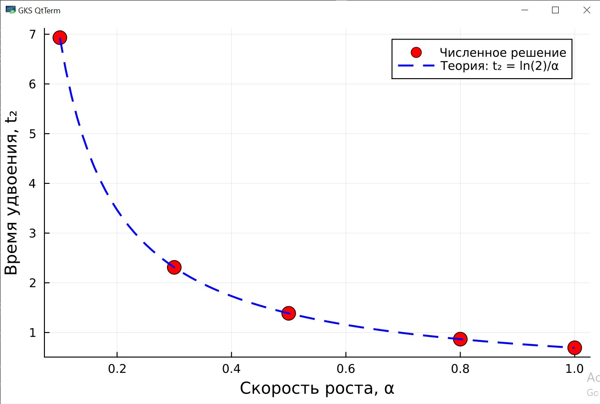{#fig-001 width=70%} 
   
   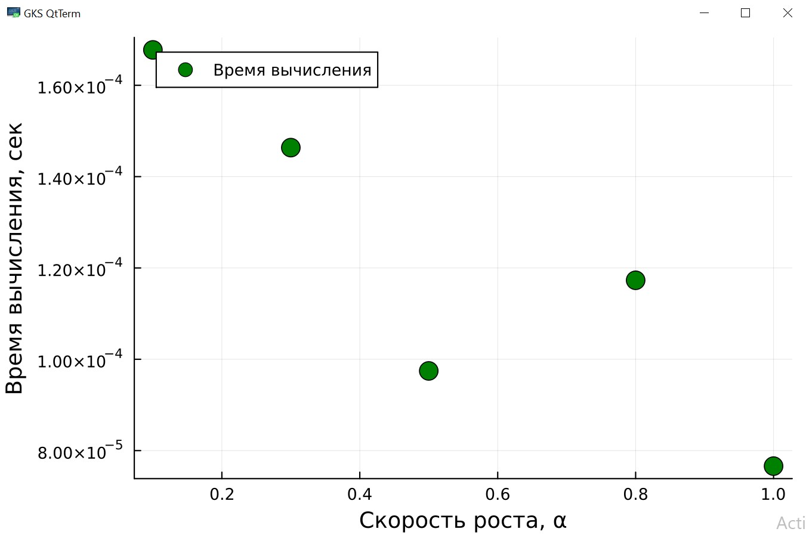{#fig-001 width=70%} 
   
   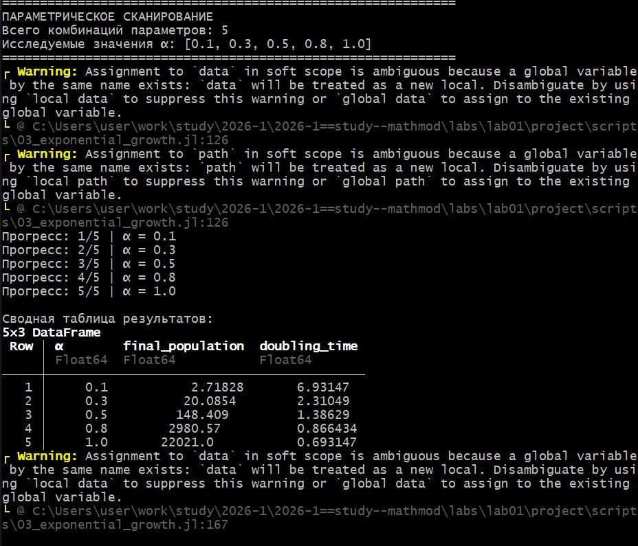{#fig-001 width=70%} 
     
   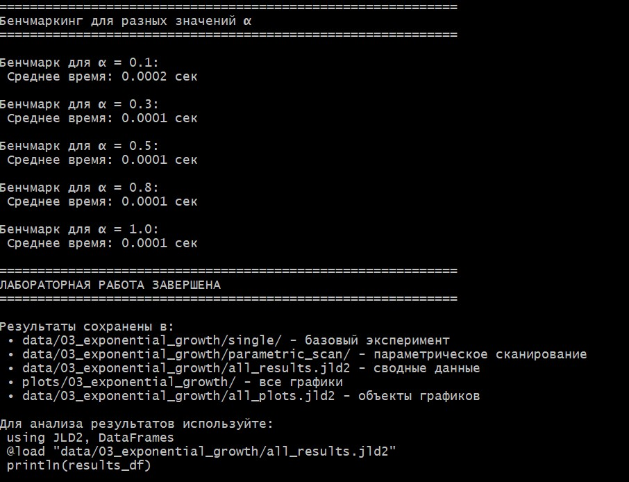{#fig-001 width=70%} 

7. **Бенчмаркинг** – измеряется время вычислений для разных α, строится зависимость.  

8. **Интеграция в финальный отчёт** – Quarto-документы подключаются в основной отчёт, настраивается движок Julia, компилируется итоговый PDF/HTML.  

# Выводы

В ходе лабораторной работы создано рабочее пространство с использованием DrWatson и GitFlow, реализована численная модель экспоненциального роста, проведено параметрическое исследование. 
Код оформлен в стиле литературного программирования (Literate.jl), на его основе сгенерированы Jupyter Notebook и документ Quarto, интегрированные в итоговый отчёт. 
Все изменения зафиксированы в репозитории с соблюдением стандарта Conventional Commits, что обеспечило воспроизводимость вычислительного эксперимента.

# Список литературы{.unnumbered}

1. Schulte E. et al. A Multi-Language Computing Environment for Literate Programming and Reproducible Research // Journal of Statistical Software. – 2012. – Vol. 46, no. 3. – DOI: 10.18637/jss.v046.i03.
2. Knuth D. E. Literate Programming // The Computer Journal. – 1984. – Vol. 27, no. 2. – P. 97–111. – DOI: 10.1093/comjnl/27.2.97.
3. Kery M. B. et al. The Story in the Notebook // Proceedings of the 2018 CHI Conference on Human Factors in Computing Systems. – ACM, 2018. – P. 1–11. – DOI: 10.1145/3173574.3173748.
4. Driessen V. A successful Git branching model [Электронный ресурс]. – URL: https://nvie.com/posts/a-successful-git-branching-model/ (дата обращения: 21.02.2026).

::: {#refs}
:::
