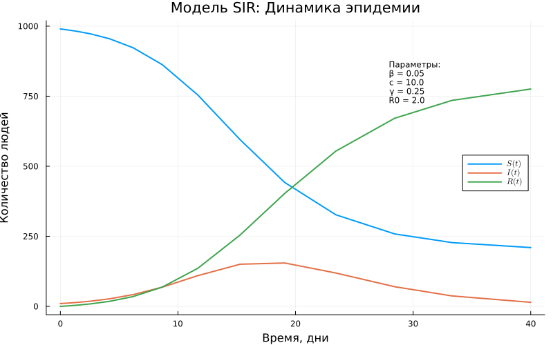

---
## Author
author:
  name: Сингх Ааруши
  degrees: DSc
  orcid: 0000-0002-0877-7063
  email: 1132215095@rudn.ru
  affiliation:
    - name: Российский университет дружбы народов
      country: Российская Федерация
      postal-code: 117198
      city: Москва
      address: ул. Миклухо-Маклая, д. 6
## Title
title: Лабораторной работе №2
subtitle: Основные модели
license: CC BY
date: 07-03-2026
date-format: "07-03-2026" 
---

# Информация

## Докладчик

:::::::::::::: {.columns align=center}
::: {.column width="70%"}

  * Сингх Ааруши
  * студентка
  * Российский университет дружбы народов им. П. Лумумбы
  * [1132215095@rudn.ru](mailto:1132215095@rudn.ru)
  * <https://github.com/Saarushi03/study_2025_2026_simmod>

:::
::: {.column width="30%"}

:::
::::::::::::::

## Цель работы

Изучить методы математического моделирования динамических систем с использованием языка программирования Julia. Освоить численное решение систем обыкновенных дифференциальных уравнений на примере модели распространения эпидемии SIR и модели Лотки–Вольтерры. Получить практические навыки визуализации результатов моделирования и анализа поведения динамических систем.

## Задание

Реализовать модель распространения эпидемии SIR.
Выполнить численное решение системы дифференциальных уравнений.
Построить графики изменения численности восприимчивых, инфицированных и выздоровевших.
Выполнить анализ полученных результатов.
Реализовать модель Лотки–Вольтерры для системы «хищник–жертва».
Построить графики динамики популяций и фазовый портрет.
Выполнить анализ поведения системы и сделать выводы.

## Выполнение лабораторной работы

## Реализация на Julia

Для выполнения лабораторной работы использовался язык программирования Julia и пакет DifferentialEquations.jl.

## Реализация на Julia

Сначала была реализована модель SIR. Для описания процесса распространения заболевания была создана функция, задающая систему дифференциальных уравнений. После задания параметров модели была сформирована задача ODEProblem и выполнено численное решение системы.

## Реализация на Julia

{#fig-001 width=70%}

## Реализация на Julia

{#fig-001 width=70%}

## Реализация на Julia

На основании полученного решения были построены графики изменения количества восприимчивых, инфицированных и выздоровевших людей. Дополнительно были построены графики динамики заражённых, фазовый портрет и график эффективного репродуктивного числа.

## Реализация на Julia

{#fig-001 width=70%}

## Реализация на Julia

Далее была реализована модель Лотки–Вольтерры. Была создана функция взаимодействия популяций хищников и жертв, заданы параметры системы и выполнено численное решение.

## Реализация на Julia

{#fig-001 width=70%}

## Реализация на Julia

{#fig-001 width=70%}

## Реализация на Julia

По результатам моделирования были построены графики динамики популяций, фазовый портрет и спектральный анализ колебаний системы.

## Реализация на Julia

{#fig-001 width=70%}

## Результаты

Полученные графики демонстрируют корректную работу обеих моделей.

В модели SIR наблюдается рост числа инфицированных до определённого максимума с последующим снижением. Число восприимчивых уменьшается, а число выздоровевших постепенно возрастает.

В модели Лотки–Вольтерры наблюдаются периодические колебания численности популяций. Рост количества жертв приводит к увеличению количества хищников. После уменьшения численности жертв снижается и численность хищников, после чего цикл повторяется.

## Выводы

В ходе лабораторной работы были изучены методы численного решения систем обыкновенных дифференциальных уравнений средствами языка Julia.

Были реализованы две математические модели: модель распространения эпидемии SIR и модель Лотки–Вольтерры. Для обеих моделей выполнено моделирование, построены графики и проведён анализ результатов.

Полученные результаты подтверждают теоретические свойства рассматриваемых моделей и демонстрируют возможности языка Julia для решения задач математического моделирования.

## Список литературы

1. Hairer E., Nørsett S., Wanner G. Solving Ordinary Differential Equations I. Springer.
2. DifferentialEquations.jl Documentation.
3. Julia Programming Language Documentation.
4. Lotka A. J. Elements of Physical Biology.
5. Volterra V. Variations and Fluctuations of the Number of Individuals in Animal Species Living Together.
6. Kermack W., McKendrick A. A Contribution to the Mathematical Theory of Epidemics.

::: {#refs}
:::

