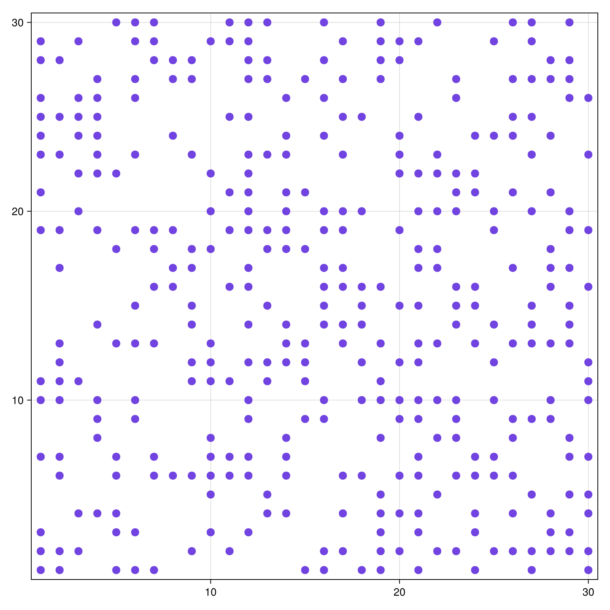
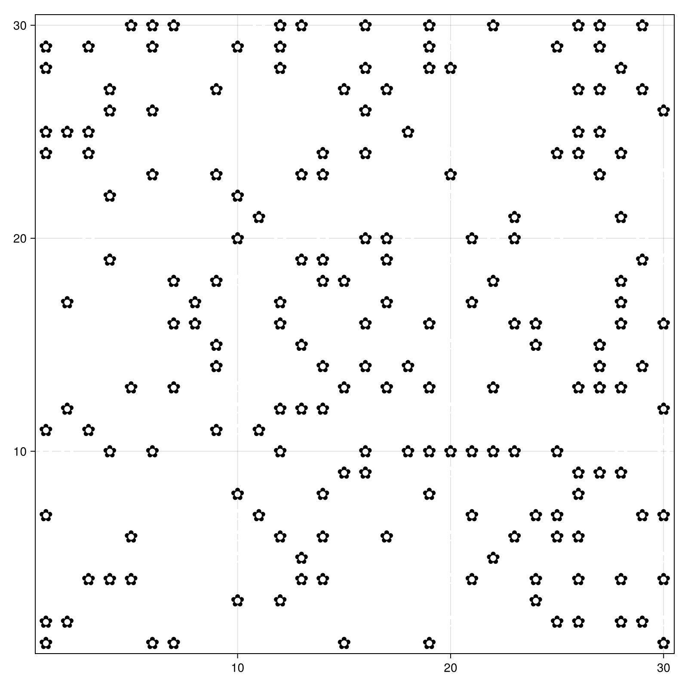
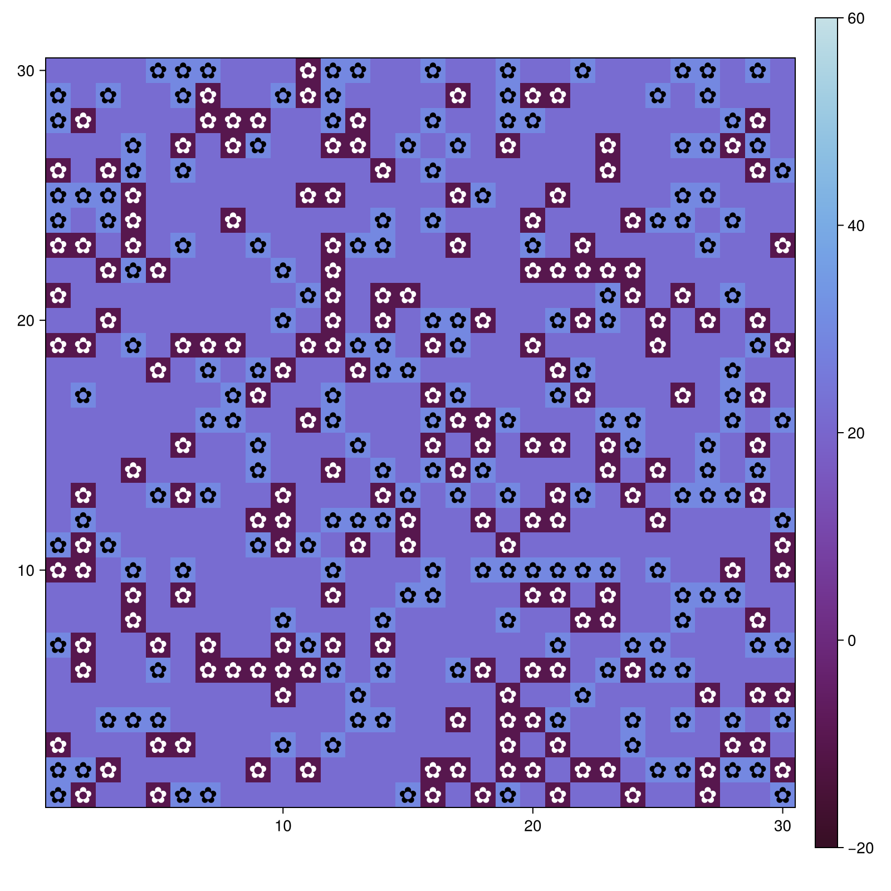
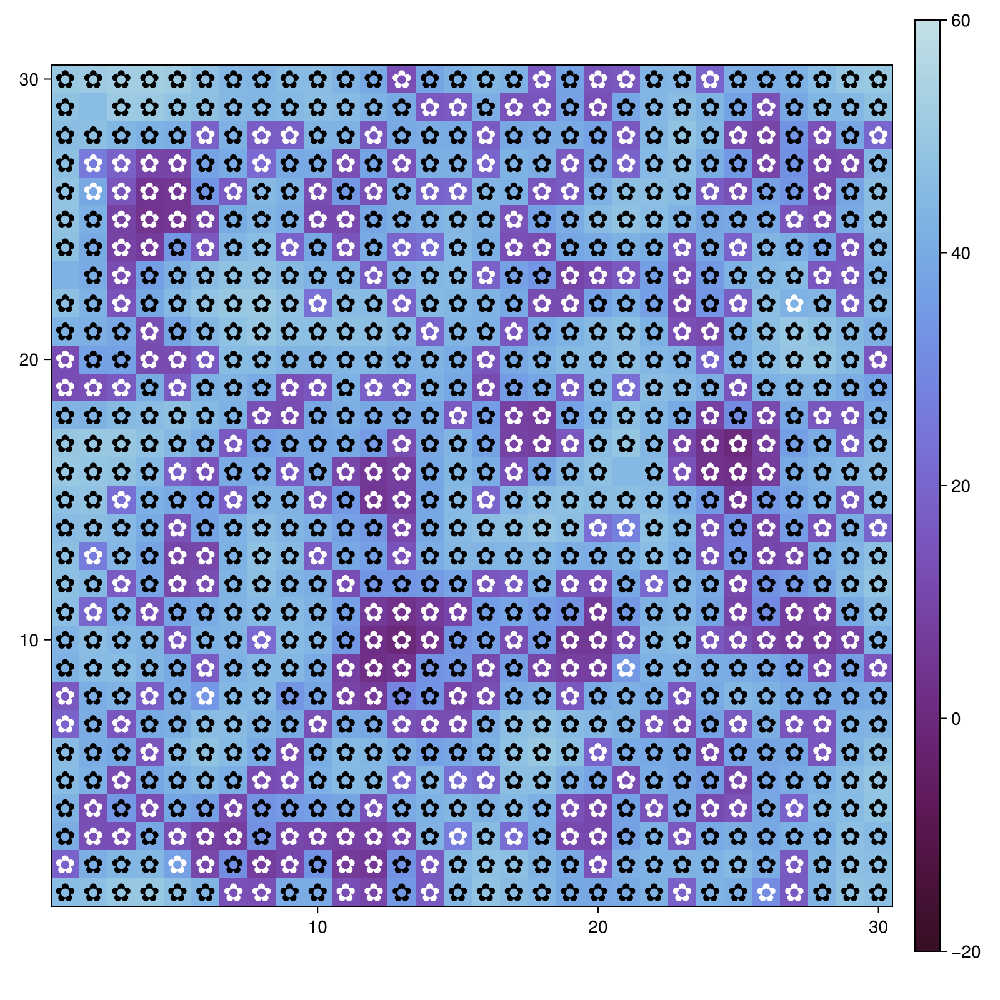
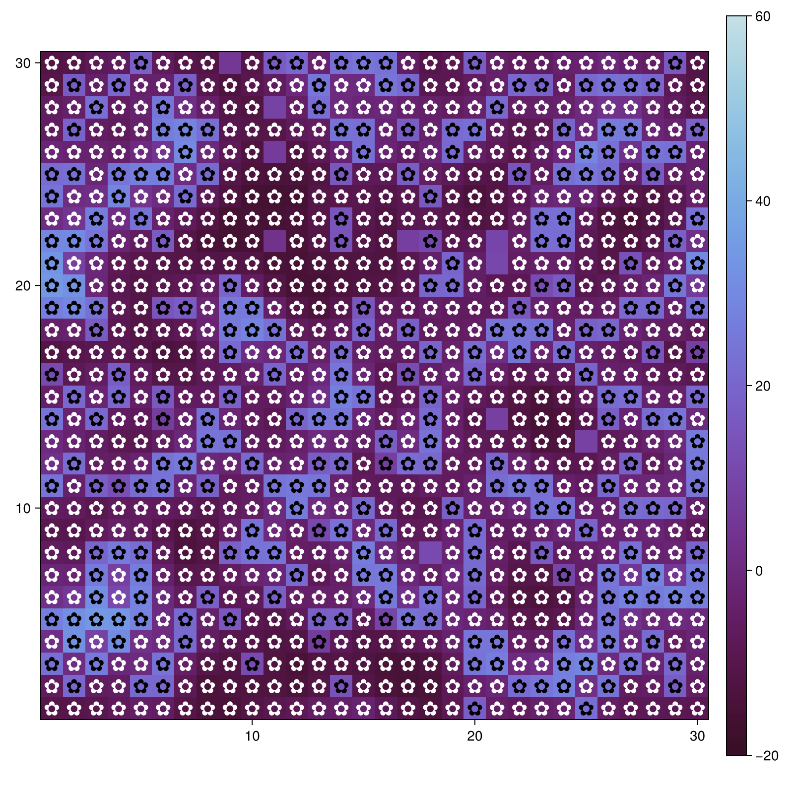

---
## Author
author:
  name: Сингх Ааруши
  degrees: DSc
  orcid: 0000-0002-0877-7063
  email: 1132215095@rudn.ru
  affiliation:
    - name: Российский университет дружбы народов
      country: Российская Федерация
      postal-code: 117198
      city: Москва
      address: ул. Миклухо-Маклая, д. 6
## Title
title: Шаблон презентация по лабораторной работе №3
subtitle: Агентное моделирование
license: CC BY
date: 19.03.2026
date-format: "2026-03-19" 
---

# Информация

## Докладчик

:::::::::::::: {.columns align=center}
::: {.column width="70%"}

  * Сингх Ааруши
  * студентка
  * Российский университет дружбы народов
  * [1132215095@pfur.ru](mailto:1132215095@pfur.ru)
  * <https://github.com/Saarushi03/study_2025_2026_simmod>

:::
::: {.column width="30%"}


:::
::::::::::::::

## Цель работы

Изучить принципы агентного моделирования на примере модели «Daisyworld», а также исследовать влияние параметров среды (солнечной светимости, альбедо, начальных условий) на динамику популяции агентов и температурный режим системы.

# Задание

1. Установить необходимые пакеты и подготовить среду разработки.

2. Изучить исходный код модели Daisyworld.

3. Запустить базовую модель.

4. Визуализировать модель с использованием графиков и анимации.

5. Провести серию экспериментов с различными параметрами.

6. Сохранить результаты моделирования (изображения и графики).

# Выполнение лабораторной работы

## Запуск базовой модели

На данном изображении показано начальное состояние модели.
Распределение чёрных и белых ромашек задаётся начальными параметрами.
Температура ещё не стабилизировалась.

```Julia
using CairoMakie
using Agents

model = daisyworld()

plt1, _ = abmplot(model)
save("step1_basic.png", plt1)
end
```

{#fig:001 width=70%}

## Визуализация агентов (цветочки ✿)

```Julia
daisycolor(a) = a.breed

plt2, _ = abmplot(model;
    agent_color = daisycolor,
    agent_size = 20,
    agent_marker = '✿'
)

save("step2_flowers.png", plt2)
end
```
{#fig:002 width=70%}

## Изменение температуры (heatmap)

```Julia
plt3, _ = abmplot(model;
    agent_color = daisycolor,
    agent_size = 20,
    agent_marker = '✿',
    heatarray = :temperature,
    heatkwargs = (colorrange = (-20, 60),)
)

save("step3_heatmap.png", plt3)
end
```

{#fig:003 width=70%}

## Динамика модели (несколько шагов)

{#fig:004 width=70%}

## Динамика модели (несколько шагов)

{#fig:005 width=70%}

## Динамика модели (несколько шагов)

{#fig:006 width=70%}

## Графики

{#fig:007 width=70%}

## Эксперименты с параметрами

{#fig:008 width=70%}

## Эксперименты с параметрами

{#fig:009 width=70%}

## Эксперименты с параметрами

{#fig:010 width=70%}


# Выводы

В ходе лабораторной работы была изучена модель Daisyworld и реализовано её моделирование с использованием агентного подхода.

# Список литературы{.unnumbered}

1. Методические указания к лабораторной работе.
2. Документация пакета Agents.jl.
3. Документация Makie.jl (визуализация).
4. Watson R., Lovelock J. — Daisyworld model.


::: {#refs}
:::