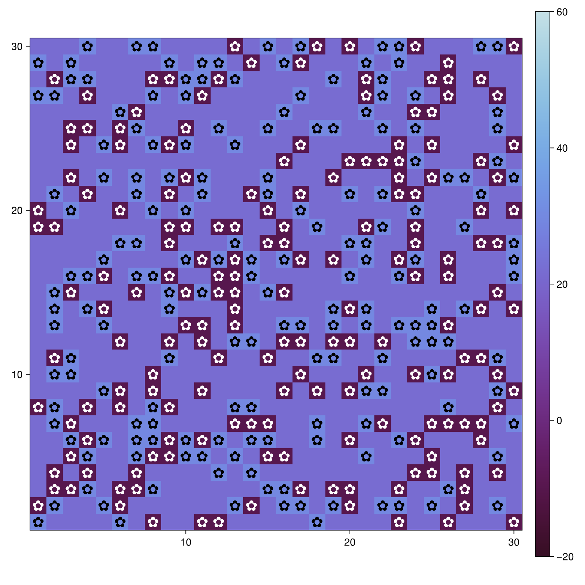
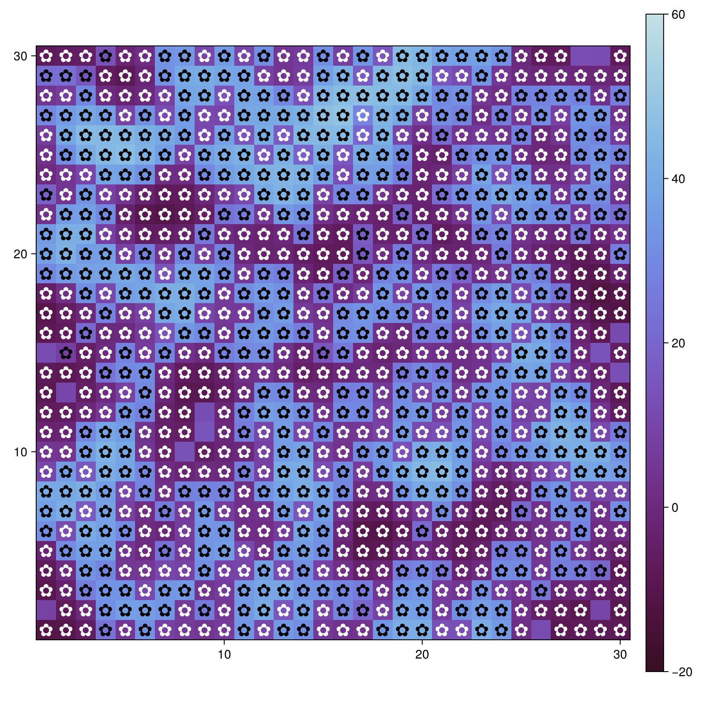
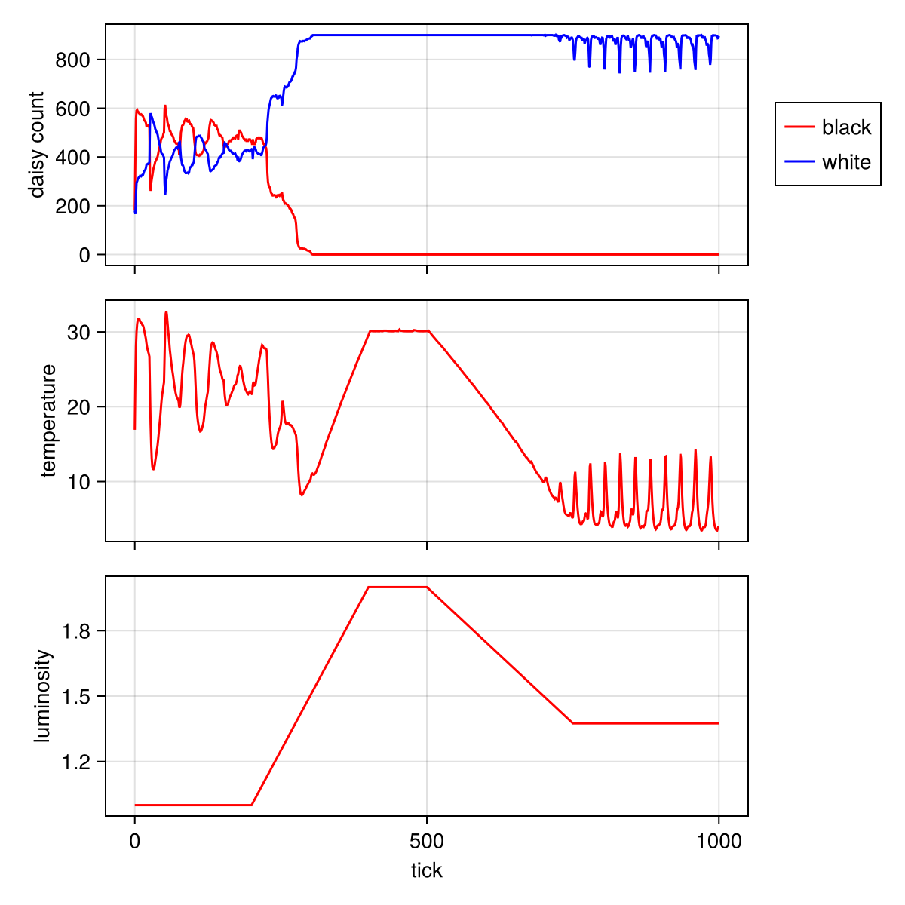
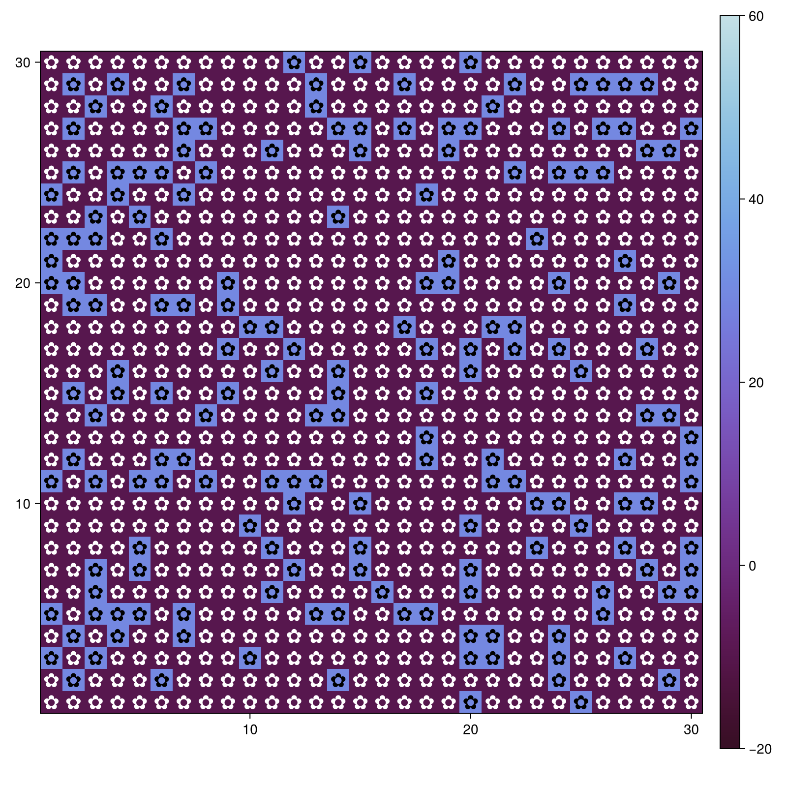
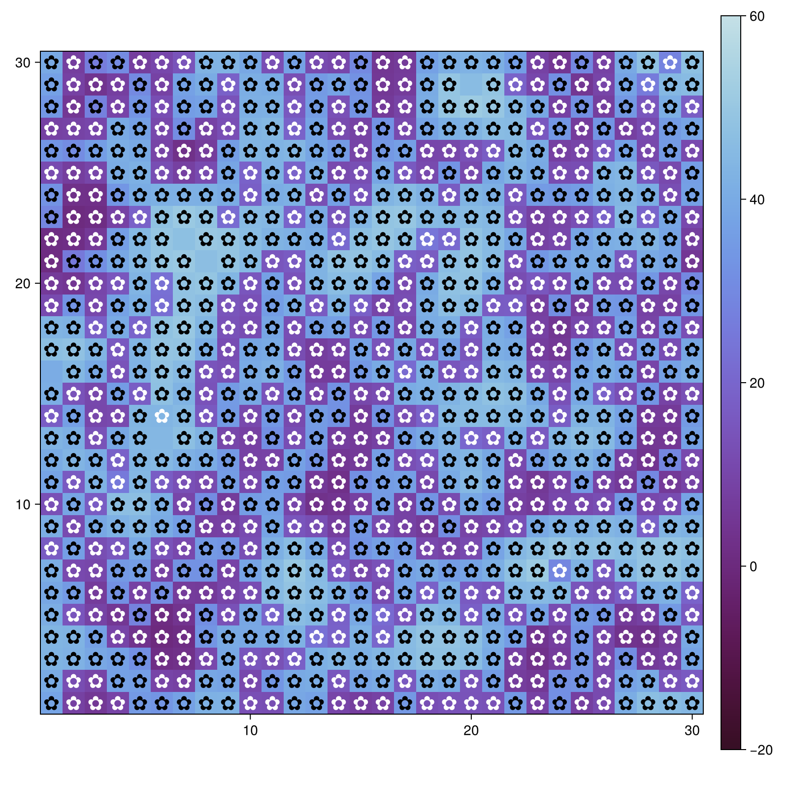

---
## Author
author:
  name: Сингх Ааруши
  degrees: DSc
  orcid: 0000-0002-0877-7063
  email: 1132215095@rudn.ru
  affiliation:
    - name: Российский университет дружбы народов
      country: Российская Федерация
      postal-code: 117198
      city: Москва
      address: ул. Миклухо-Маклая, д. 6

## Title
title: "Шаблон отчёта по лабораторной работе №3"
subtitle: "Агентное моделирование"
license: "CC BY"
---

# Цель работы

Изучить принципы агентного моделирования на примере модели «Daisyworld», а также исследовать влияние параметров среды (солнечной светимости, альбедо, начальных условий) на динамику популяции агентов и температурный режим системы.

# Задание

1. Установить необходимые пакеты и подготовить среду разработки.
2. Изучить исходный код модели Daisyworld.
3. Запустить базовую модель.
4. Визуализировать модель с использованием графиков и анимации.
5. Провести серию экспериментов с различными параметрами.
6. Сохранить результаты моделирования (изображения и графики).

# Теоретическое введение

Модель Daisyworld представляет собой абстрактную экологическую систему, предложенную для демонстрации механизма саморегуляции климата.
В модели рассматриваются два типа агентов:
чёрные ромашки (поглощают тепло),
белые ромашки (отражают тепло).
Каждый тип влияет на температуру поверхности:
чёрные ромашки увеличивают температуру,
белые уменьшают её.
Температура, в свою очередь, влияет на рост и выживаемость агентов. 
Таким образом возникает обратная связь, обеспечивающая устойчивость системы.
Модель реализуется с использованием агентного подхода, где каждый агент действует по локальным правилам, а глобальное поведение возникает как результат взаимодействий.

# Выполнение лабораторной работы

## Запуск базовой модели
Была создана модель с начальными параметрами и выполнен её запуск.

{#fig-001 width=70%}

На данном изображении показано начальное состояние модели.
Распределение чёрных и белых ромашек задаётся начальными параметрами.
Температура ещё не стабилизировалась.

## Визуализация агентов (цветочки ✿)
Был настроен внешний вид агентов с использованием маркера '✿'.

{#fig-002 width=70%}

В данной визуализации агенты представлены в виде символов цветка.
Цвет отражает тип ромашек: чёрные и белые.
Это улучшает наглядность модели.

## Изменение температуры (heatmap)
Добавлена визуализация температуры.

{#fig-003 width=70%}

Здесь отображено распределение температуры по поверхности.
Видно, как разные типы ромашек влияют на нагрев среды.
Тёмные области соответствуют более высокой температуре.

## Динамика модели (несколько шагов)
Модель была запущена на несколько шагов.

{#fig-004 width=70%}

{#fig-005 width=70%}

{#fig-006 width=70%}

На этих изображениях показана эволюция модели во времени.
На начальном этапе распределение случайное,
затем система начинает самоорганизовываться.
К 40-му шагу наблюдается более стабильное состояние.

## Графики
Построены графики:
количество ромашек
температура
солнечная светимость

{#fig-007 width=70%}

На графике показано изменение количества чёрных и белых ромашек во времени.
Также отображается температура и уровень солнечной светимости.
Видно, как система адаптируется к изменениям условий.

## Эксперименты с параметрами
Был выполнен перебор параметров:
init_white
max_age
и др.

{#fig-008 width=70%}

{#fig-009 width=70%}

{#fig-010 width=70%}

Здесь представлены результаты моделирования при различных параметрах.
Изменение начальных условий влияет на развитие системы.
Это позволяет исследовать устойчивость модели.

# Выводы

В ходе лабораторной работы была изучена модель Daisyworld и реализовано её моделирование с использованием агентного подхода.
Было показано, что:
система способна к саморегуляции,
взаимодействие агентов влияет на глобальные параметры,
изменение начальных условий и параметров приводит к различным сценариям развития.
Также были получены навыки работы с визуализацией данных и сохранением результатов моделирования.

# Список литературы{.unnumbered}

1. Методические указания к лабораторной работе.
2. Документация пакета Agents.jl.
3. Документация Makie.jl (визуализация).
4. Watson R., Lovelock J. — Daisyworld model.

::: {#refs}
:::
