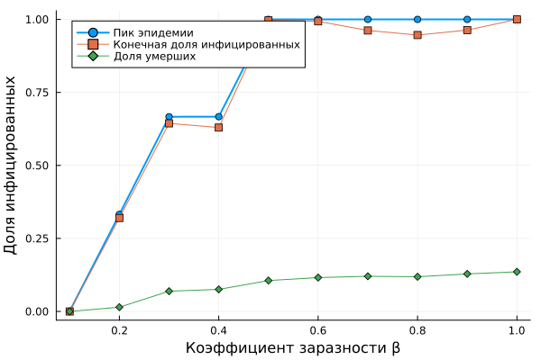

---
## Author
author:
  name: Сингх Ааруши
  degrees: DSc
  orcid: 0000-0002-0877-7063
  email: 1132215095@rudn.ru
  affiliation:
    - name: Российский университет дружбы народов
      country: Российская Федерация
      postal-code: 117198
      city: Москва
      address: ул. Миклухо-Маклая, д. 6
## Title
title: Презентации №4
subtitle: Реализация основных моделей в агентном подходе
license: CC BY
date: 04-04-2026
date-format: "2026-04-04" 
---

# Информация

## Докладчик

:::::::::::::: {.columns align=center}
::: {.column width="70%"}

  * Сингх Ааруши
  * студентка
  * Российский университет дружбы народов им. П. Лумумбы
  * [1132215095@rudn.ru](mailto:1132215095@rudn.ru)
  * <https://github.com/Saarushi03/study_2025_2026_simmod>

:::
::: {.column width="30%"}

:::
::::::::::::::

# Цель работы

Изучить методы агентного моделирования эпидемиологических процессов с использованием языка программирования Julia и библиотеки Agents.jl.
Исследовать влияние коэффициента заражения, миграции населения и параметров заболевания на динамику распространения инфекции.
Освоить методы визуализации и анализа результатов моделирования.

# Задание

Реализовать агентную модель распространения инфекционного заболевания типа SIR.
Выполнить моделирование распространения инфекции между тремя городами.
Исследовать влияние коэффициента заражения β на развитие эпидемии.
Исследовать влияние миграции населения между городами.
Выполнить оптимизацию параметров модели.
Построить графики динамики эпидемического процесса.
Провести анализ полученных результатов.

# Выполнение лабораторной работы

Для реализации модели использовался язык программирования Julia и библиотека Agents.jl.
В файле sir_model.jl реализована основная логика модели:
• создание агентов;
• миграция между городами;
• заражение агентов;
• выздоровление и смертность.
Для проведения экспериментов были разработаны следующие сценарии:
Базовое моделирование эпидемии.
Исследование влияния коэффициента заражения β.
Исследование влияния миграции населения.
Оптимизация параметров модели.
Итоговый анализ результатов.
После выполнения расчётов были построены графики и сохранены результаты моделирования.

## Результаты моделирования

Базовая динамика эпидемии
На рисунке 1 представлена динамика изменения численности восприимчивых, инфицированных и выздоровевших агентов.

{#fig-001 width=70%}

Анализ графика показывает рост количества инфицированных на начальном этапе с последующим снижением после достижения максимума. Количество выздоровевших постепенно увеличивается.

## Исследование коэффициента заражения

На рисунке 2 показано влияние коэффициента заражения β на развитие эпидемии.

{#fig-001 width=70%}

При увеличении коэффициента заражения наблюдается увеличение числа заболевших и рост максимального значения инфицированных агентов.

## Исследование миграции населения

На рисунке 3 представлены результаты анализа влияния миграции между городами.

{#fig-001 width=70%}

Увеличение интенсивности миграции приводит к более быстрому распространению инфекции между населёнными пунктами.

## Оптимизация параметров

В ходе оптимизации были определены параметры модели, обеспечивающие минимальные значения заболеваемости и смертности.
Результаты оптимизации сохранены в файле optimization_result.jld2.

## Комплексный анализ

На рисунке 4 представлены итоговые показатели модели.

{#fig-001 width=70%}

График позволяет сравнить различные характеристики эпидемии и оценить эффективность выбранных параметров.

# Выводы

В ходе выполнения лабораторной работы была разработана агентная модель распространения инфекционного заболевания в среде Julia.
Были изучены основные механизмы распространения инфекции, включая заражение, выздоровление, смертность и миграцию населения.
Проведённые эксперименты показали, что коэффициент заражения и интенсивность миграции оказывают существенное влияние на скорость распространения заболевания и количество инфицированных.
Полученные результаты подтверждают эффективность агентного моделирования для исследования эпидемиологических процессов.

# Список литературы{.unnumbered}

1. Wilensky U., Rand W. An Introduction to Agent-Based Modeling. MIT Press, 2015.
2. Railsback S., Grimm V. Agent-Based and Individual-Based Modeling. Princeton University Press, 2019.
3. Documentation of Agents.jl. https://juliadynamics.github.io/Agents.jl
4. Documentation of Julia Programming Language. https://julialang.org
5. Documentation of DrWatson.jl. https://juliadynamics.github.io/DrWatson.jl
6. Kermack W.O., McKendrick A.G. A Contribution to the Mathematical Theory of Epidemics. Proceedings of the Royal Society, 1927.

:::
