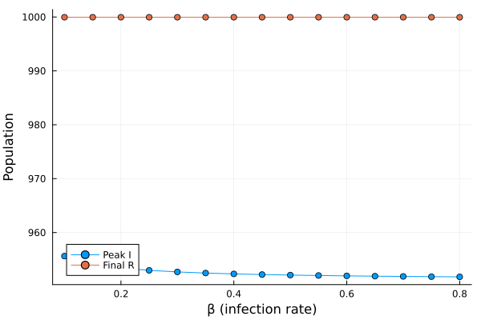

---
## Author
author:
  name:  Сингх Ааруши
  degrees: DSc
  orcid: 0000-0002-0877-7063
  email: 1132215095@rudn.ru
  affiliation:
    - name: Российский университет дружбы народов
      country: Российская Федерация
      postal-code: 117198
      city: Москва
      address: ул. Миклухо-Маклая, д. 6

## Title
title: "Лабораторная работа №6"
subtitle: "Реализация основных моделей в подходе сетей Петри
"
license: "CC BY"
---

# Цель работы

Целью данной лабораторной работы является изучение модели распространения эпидемии SIR и её реализация с использованием сетей Петри на языке программирования Julia.

# Задание

В рамках лабораторной работы необходимо:
Создать рабочую структуру проекта.
Реализовать модель SIR с использованием сетей Петри.
Выполнить:
детерминированную симуляцию;
стохастическую симуляцию.
Построить графики изменения численности S, I и R.
Исследовать влияние параметра β (коэффициента заражения).
Построить графики зависимости результатов от параметров.

# Теоретическое введение

Модель SIR — это классическая математическая модель распространения инфекционных заболеваний.
Популяция делится на три группы:
S (Susceptible) — восприимчивые;
I (Infected) — инфицированные;
R (Recovered) — выздоровевшие.
Переходы между состояниями:
заражение: S + I → I + I
выздоровление: I → R
Основные параметры модели:
β (бета) — коэффициент заражения;
γ (гамма) — коэффициент выздоровления.
Динамика модели описывается системой дифференциальных уравнений, либо моделируется стохастически с помощью алгоритма Гиллеспи.
Сети Петри позволяют удобно описывать такие переходы и анализировать динамику системы.

# Выполнение лабораторной работы

## Подключение модуля

include("../src/SIRPetri.jl")
using .SIRPetri

## Задание параметров

β = 0.3
γ = 0.1
tmax = 100.0

Начальные значения:
S = 990
I = 10
R = 0

## Детерминированная симуляция

df_det = simulate_deterministic(net, u0, (0.0, tmax))

{#fig-001 width=70%}

количество инфицированных сначала растёт, затем падает;
наблюдается пик эпидемии;
число выздоровевших увеличивается.

## Стохастическая симуляция

df_stoch = simulate_stochastic(net, u0, (0.0, tmax))

{#fig-002 width=70%}

график имеет случайные колебания;
поведение в целом совпадает с детерминированной моделью

## Исследование параметра β

β_range = 0.1:0.05:0.8
peak_I = maximum(df.I)

{#fig-003 width=70%}

при малых значениях β эпидемия не развивается;
при увеличении β резко возрастает число инфицированных;
наблюдается пороговый эффект.

## Сравнение моделей

plot(df_det.I, df_stoch.I)

{#fig-004 width=70%}

стохастическая модель имеет колебания;
детерминированная модель более сглаженная.

# Выводы

В ходе лабораторной работы была реализована модель SIR с использованием сетей Петри.
Были получены следующие результаты:
подтверждено наличие пика эпидемии;
показано влияние параметра β на распространение заболевания;
выявлены различия между детерминированной и стохастической моделями.
Сети Петри показали себя удобным инструментом для моделирования динамических систем.

# Список литературы{.unnumbered}

1. Материалы лабораторной работы.
2. Документация Julia — https://docs.julialang.org
3. Документация пакета OrdinaryDiffEq.
4. Вики: модель SIR.

::: {#refs}
:::
