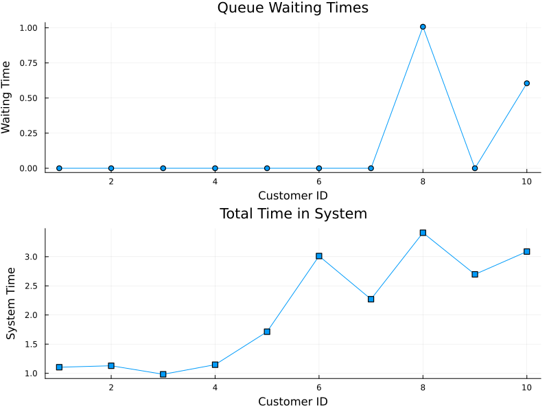

---
## Author
author:
  name: Сингх Ааруши
  degrees: DSc
  orcid: 0000-0002-0877-7063
  email: 1132215095@rudn.ru
  affiliation:
    - name: Российский университет дружбы народов
      country: Российская Федерация
      postal-code: 117198
      city: Москва
      address: ул. Миклухо-Маклая, д. 6
## Title
title: Презентация по лабораторной работе №7
subtitle: Дискретно-событийное моделирование
license: CC BY
date: 15-05-2026
date-format: "2026-05-15" 
---

# Информация

## Докладчик

:::::::::::::: {.columns align=center}
::: {.column width="70%"}

  * Сингх Ааруши
  * студентка
  * Российский университет дружбы народов им. П. Лумумбы
  * [1132215095@rudn.ru](mailto:1132215095@rudn.ru)
  * <https://github.com/Saarushi03/study_2025_2026_simmod>

:::
::: 

:::
::::::::::::::

## Цель работы

Изучить методы дискретно-событийного моделирования, реализовать модель M/M/c и модель Росса, выполнить моделирование в среде Jupyter Notebook на языке Julia, а также построить графики и провести анализ результатов.

## Задание

В ходе лабораторной работы требовалось:
Создать рабочий каталог проекта.
Установить необходимые пакеты Julia.
Реализовать модель M/M/c.
Реализовать модель Росса.
Выполнить моделирование.
Построить графики.
Проанализировать результаты моделирования.

## Выполнение лабораторной работы

## Реализация модели M/M/c
В модели были заданы:
количество серверов;
интенсивность поступления заявок;
интенсивность обслуживания.
В ходе моделирования определялись:
время прибытия заявок;
время ожидания;
время обслуживания.
Были построены графики:
времени ожидания;
общего времени нахождения заявок в системе. 

## Реализация на Julia

{#fig-001 width=70%}

## Реализация модели Росса
В модели были заданы:
количество рабочих машин;
количество резервных машин;
параметры отказов;
параметры ремонта.
В ходе моделирования анализировалось:
изменение количества исправных машин;
время до отказа системы.
Был построен график изменения числа запасных машин во времени.

## Реализация на Julia

{#fig-001 width=70%}

## Выводы

В ходе лабораторной работы были изучены методы дискретно-событийного моделирования.
Были реализованы:
модель M/M/c;
модель Росса.
Также были построены графики и выполнен анализ эффективности и надёжности систем.

## Список литературы

1. Росс Ш.
   Теория вероятностей. — Москва: Академкнига, 2010.
2. Клейнрок Л.
   Теория массового обслуживания. — Москва: Машиностроение, 1979.
3. Гнеденко Б. В.
   Курс теории вероятностей. — Москва: URSS, 2015.
4. Law A. M.
   Simulation Modeling and Analysis. — New York: McGraw-Hill, 2015.
5. Banks J.
   Discrete-Event System Simulation. — Pearson Education, 2010.

::: {#refs}
:::

