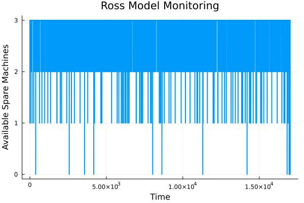

---
## Author
author:
  name: Сингх Ааруши
  degrees: DSc
  orcid: 0000-0002-0877-7063
  email: 1132215095@rudn.ru
  affiliation:
    - name: Российский университет дружбы народов
      country: Российская Федерация
      postal-code: 117198
      city: Москва
      address: ул. Миклухо-Маклая, д. 6

## Title
title: "Шаблон отчёта по лабораторной работе №7"
subtitle: "Дискретно-событийное моделирование"
license: "CC BY"
---

# Цель работы

Изучить методы дискретно-событийного моделирования, реализовать модель M/M/c и модель Росса, выполнить моделирование в среде Jupyter Notebook на языке Julia, а также построить графики и провести анализ результатов.

# Задание

В ходе лабораторной работы требовалось:
Создать рабочий каталог проекта.
Установить необходимые пакеты Julia.
Реализовать модель M/M/c.
Реализовать модель Росса.
Выполнить моделирование.
Построить графики.
Проанализировать результаты моделирования.

# Теоретическое введение

## Модель M/M/c
Модель M/M/c представляет собой систему массового обслуживания с несколькими каналами обслуживания.
Особенности модели:
входящий поток заявок является пуассоновским;
время обслуживания распределено по экспоненциальному закону;
система содержит несколько серверов.
Основные параметры модели:
λ — интенсивность входящего потока;
μ — интенсивность обслуживания;
c — количество каналов обслуживания.
Модель используется для анализа:
времени ожидания;
загрузки системы;
длины очереди;
эффективности обслуживания.

## Модель Росса
Модель Росса используется для исследования надёжности технических систем.
Система состоит из:
основных машин;
резервных машин;
ремонтного устройства.
При отказе рабочей машины:
используется резервная машина;
неисправная машина отправляется в ремонт.
Если резерв отсутствует, происходит отказ системы.
Модель позволяет оценить:
среднее время работы системы;
влияние количества резервных машин;
влияние скорости ремонта.

# Выполнение лабораторной работы

## Реализация модели M/M/c
В модели были заданы:
количество серверов;
интенсивность поступления заявок;
интенсивность обслуживания.
В ходе моделирования определялись:
время прибытия заявок;
время ожидания;
время обслуживания.
Были построены графики:
времени ожидания;
общего времени нахождения заявок в системе. 

{#fig-001 width=70%}

## Реализация модели Росса
В модели были заданы:
количество рабочих машин;
количество резервных машин;
параметры отказов;
параметры ремонта.
В ходе моделирования анализировалось:
изменение количества исправных машин;
время до отказа системы.
Был построен график изменения числа запасных машин во времени.

{#fig-001 width=70%}

В результате выполнения лабораторной работы были получены:
графики работы систем;
данные о времени ожидания;
данные о времени работы системы до отказа.
Анализ показал:
увеличение количества серверов уменьшает время ожидания;
увеличение числа резервных машин повышает надёжность системы;
увеличение количества ремонтников ускоряет восстановление системы.

# Выводы

В ходе лабораторной работы были изучены методы дискретно-событийного моделирования.
Были реализованы:
модель M/M/c;
модель Росса.
Также были построены графики и выполнен анализ эффективности и надёжности систем.

# Список литературы{.unnumbered}

# Список литературы

1. Росс Ш.
   Теория вероятностей. — Москва: Академкнига, 2010.

2. Клейнрок Л.
   Теория массового обслуживания. — Москва: Машиностроение, 1979.

3. Гнеденко Б. В.
   Курс теории вероятностей. — Москва: URSS, 2015.

4. Law A. M.
   Simulation Modeling and Analysis. — New York: McGraw-Hill, 2015.

5. Banks J.
   Discrete-Event System Simulation. — Pearson Education, 2010.

::: {#refs}
:::
