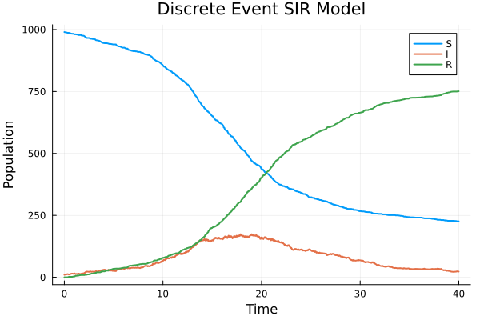
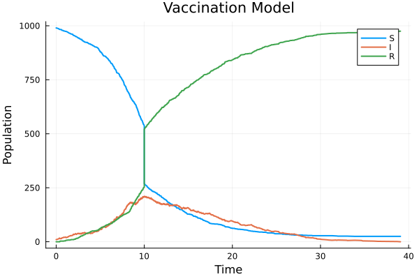
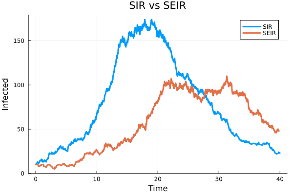

---
## Author
author:
  name: Сингх Ааруши
  degrees: DSc
  orcid: 0000-0002-0877-7063
  email: 1132215095@rudn.ru
  affiliation:
    - name: Российский университет дружбы народов
      country: Российская Федерация
      postal-code: 117198
      city: Москва
      address: ул. Миклухо-Маклая, д. 6
## Title
title: Лабораторной работе №8
subtitle: Реализация основных моделей в дискретно-событийном подходе
license: CC BY
date: 2026-05-30
date-format: "2026-05-30" 
---

# Информация

## Докладчик

:::::::::::::: {.columns align=center}
::: {.column width="70%"}
* Сингх Ааруши
  * студентка
  * Российский университет дружбы народов им. П. Лумумбы
  * [1132215095@rudn.ru](mailto:1132215095@rudn.ru)
  * <https://github.com/Saarushi03/study_2025_2026_simmod>

:::
::: {.column width="30%"}

:::
::::::::::::::

## Цель работы

Изучить дискретно-событийный подход к имитационному моделированию на примере моделей распространения инфекции SIR и SEIR. Реализовать стохастическую дискретно-событийную модель на языке Julia, исследовать влияние параметров модели, выполнить анализ чувствительности, реализовать вакцинацию и модифицировать модель с учётом латентного периода инфекции.

## Задание

В ходе лабораторной работы необходимо:
Реализовать дискретно-событийную модель SIR.
Построить графики изменения численности групп S, I и R.
Провести анализ чувствительности модели к параметрам.
Реализовать детерминированную длительность болезни.
Выполнить оценку производительности модели.
Реализовать сохранение результатов в CSV-файл.
Реализовать механизм вакцинации.
Реализовать расширенную модель SEIR.
Сравнить результаты различных моделей.

## Выполнение лабораторной работы

После запуска симуляции был получен график изменения численности групп S, I и R.
Анализ графика показал:
количество восприимчивых постепенно уменьшается;
количество инфицированных сначала растёт, затем снижается;
количество выздоровевших постоянно увеличивается.
Это соответствует классической динамике эпидемии.

## Реализация на Julia

{#fig-001 width=70%}

## Анализ чувствительности

Был выполнен анализ влияния параметра β на распространение инфекции.
Использовались различные значения вероятности заражения:
β = 0.03;
β = 0.05;
β = 0.07.
Результаты показали:
при увеличении β инфекция распространяется быстрее;
пик числа инфицированных становится выше;
эпидемия развивается интенсивнее.

## Реализация на Julia

{#fig-001 width=70%}

## Детерминированная длительность болезни

В модели стохастическое время выздоровления было заменено фиксированным значением.
Это позволило сравнить:
стохастическую модель;
детерминированную модель.
В результате было установлено, что детерминированная модель даёт более гладкие и синхронные кривые выздоровления.

## Оценка производительности

С помощью библиотеки BenchmarkTools была выполнена оценка времени выполнения модели.
Для популяции большого размера было измерено:
время выполнения;
использование памяти;
производительность симуляции.
Были рассмотрены возможные методы оптимизации:
предварительная генерация случайных чисел;
сокращение числа событий;
векторизация вычислений.

## Реализация вакцинации

В модель был добавлен механизм вакцинации.
В определённый момент времени часть восприимчивых агентов переводилась в состояние R.
Результаты показали:
уменьшение числа восприимчивых;
снижение числа инфицированных;
ослабление эпидемии.

## Реализация на Julia

{#fig-001 width=70%}

## Реализация модели SEIR

В модель было добавлено состояние E — латентная стадия заболевания.
После заражения агент:
переходил в состояние E;
ожидал завершения инкубационного периода;
становился инфекционным;
затем выздоравливал.
Был построен график SEIR.
Анализ показал:
эпидемия развивается медленнее;
пик инфекции возникает позже;
наличие инкубационного периода задерживает распространение инфекции.

## Реализация на Julia

{#fig-001 width=70%}

## Сравнение моделей SIR и SEIR

Было выполнено сравнение моделей SIR и SEIR.
Установлено, что модель SEIR более реалистично описывает заболевания с инкубационным периодом.
Основные отличия:
наличие скрытой стадии заболевания;
задержка роста числа инфицированных;
более плавное развитие эпидемии.

## Реализация на Julia

{#fig-001 width=70%}

## Выводы

В результате работы были получены навыки:
дискретно-событийного моделирования;
работы с агентными моделями;
анализа эпидемических процессов;
построения и анализа графиков.
Полученные результаты показали влияние параметров модели на динамику распространения инфекции и подтвердили эффективность расширения модели SEIR.

## Список литературы

Методические указания к лабораторной работе.
Документация Julia Language. URL: https://julialang.org
Документация ConcurrentSim.jl. URL: https://juliadynamics.github.io/ConcurrentSim.jl
Документация StatsPlots.jl.
Hethcote H. W. The Mathematics of Infectious Diseases // SIAM Review.

::: {#refs}
:::

