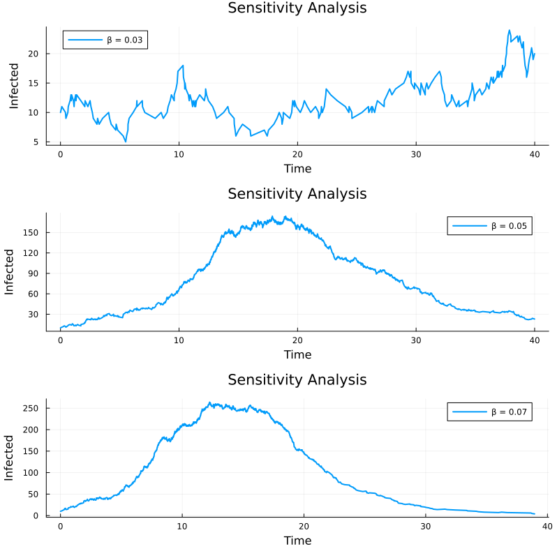
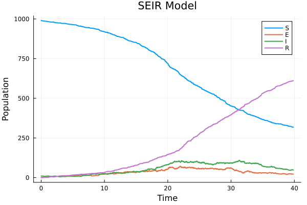

---
## Author
author:
  name: Сингх Ааруши
  degrees: DSc
  orcid: 0000-0002-0877-7063
  email: 1132215095@rudn.ru
  affiliation:
    - name: Российский университет дружбы народов
      country: Российская Федерация
      postal-code: 117198
      city: Москва
      address: ул. Миклухо-Маклая, д. 6

## Title
title: "Отчёта по лабораторной работе №8"
subtitle: "Реализация основных моделей в дискретно-событийном подходе"
license: "CC BY"
---

# Цель работы

Изучить дискретно-событийный подход к имитационному моделированию на примере моделей распространения инфекции SIR и SEIR. Реализовать стохастическую дискретно-событийную модель на языке Julia, исследовать влияние параметров модели, выполнить анализ чувствительности, реализовать вакцинацию и модифицировать модель с учётом латентного периода инфекции.

# Задание

В ходе лабораторной работы необходимо:
Реализовать дискретно-событийную модель SIR.
Построить графики изменения численности групп S, I и R.
Провести анализ чувствительности модели к параметрам.
Реализовать детерминированную длительность болезни.
Выполнить оценку производительности модели.
Реализовать сохранение результатов в CSV-файл.
Реализовать механизм вакцинации.
Реализовать расширенную модель SEIR.
Сравнить результаты различных моделей.

# Теоретическое введение

Имитационное моделирование используется для исследования сложных систем, поведение которых трудно описать аналитически. Одним из подходов является дискретно-событийное моделирование, при котором система изменяет своё состояние только в моменты наступления событий.
В данной работе моделируется распространение инфекционного заболевания в популяции.

## Модель SIR

Модель SIR делит популяцию на три группы:
S (Susceptible) — восприимчивые к инфекции;
I (Infected) — инфицированные;
R (Recovered) — выздоровевшие.

Переходы между состояниями:
S → I → R
В модели используются параметры:
β — вероятность заражения;
c — интенсивность контактов;
γ — интенсивность выздоровления.
Модель является стохастической, так как события заражения и выздоровления происходят случайным образом.

## Дискретно-событийный подход

В дискретно-событийной модели каждый индивид моделируется как отдельный агент. Для каждого агента создаётся независимый процесс, который выполняется параллельно с другими процессами.
Время между событиями генерируется случайным образом по экспоненциальному распределению.

## Модель SEIR

Модель SEIR является расширением модели SIR и включает дополнительное состояние:
E (Exposed) — заражённые, но ещё не инфекционные.
Переходы:
S → E → I → R

# Выполнение лабораторной работы

В Jupyter Notebook были подключены необходимые библиотеки:
ConcurrentSim;
ResumableFunctions;
DataFrames;
StatsPlots;
Distributions.
Были реализованы структуры данных для описания агентов и модели.
Каждый агент имел собственное состояние:
S;
I;
R.
Для моделирования поведения агента была реализована функция жизненного цикла, в которой:
Агент ожидает случайное время до контакта.
Выбирает случайного собеседника.
При контакте с инфицированным может заразиться.
После заражения через случайное время выздоравливает.

После запуска симуляции был получен график изменения численности групп S, I и R.
Анализ графика показал:
количество восприимчивых постепенно уменьшается;
количество инфицированных сначала растёт, затем снижается;
количество выздоровевших постоянно увеличивается.
Это соответствует классической динамике эпидемии.

{#fig-001 width=70%}

## Анализ чувствительности

Был выполнен анализ влияния параметра β на распространение инфекции.
Использовались различные значения вероятности заражения:
β = 0.03;
β = 0.05;
β = 0.07.
Результаты показали:
при увеличении β инфекция распространяется быстрее;
пик числа инфицированных становится выше;
эпидемия развивается интенсивнее.

{#fig-001 width=70%}

## Детерминированная длительность болезни

В модели стохастическое время выздоровления было заменено фиксированным значением.
Это позволило сравнить:
стохастическую модель;
детерминированную модель.
В результате было установлено, что детерминированная модель даёт более гладкие и синхронные кривые выздоровления.

## Оценка производительности

С помощью библиотеки BenchmarkTools была выполнена оценка времени выполнения модели.
Для популяции большого размера было измерено:
время выполнения;
использование памяти;
производительность симуляции.
Были рассмотрены возможные методы оптимизации:
предварительная генерация случайных чисел;
сокращение числа событий;
векторизация вычислений.

## Реализация вакцинации

В модель был добавлен механизм вакцинации.
В определённый момент времени часть восприимчивых агентов переводилась в состояние R.
Результаты показали:
уменьшение числа восприимчивых;
снижение числа инфицированных;
ослабление эпидемии.

{#fig-001 width=70%}

## Реализация модели SEIR

В модель было добавлено состояние E — латентная стадия заболевания.
После заражения агент:
переходил в состояние E;
ожидал завершения инкубационного периода;
становился инфекционным;
затем выздоравливал.
Был построен график SEIR.
Анализ показал:
эпидемия развивается медленнее;
пик инфекции возникает позже;
наличие инкубационного периода задерживает распространение инфекции.

{#fig-001 width=70%}

## Сравнение моделей SIR и SEIR

Было выполнено сравнение моделей SIR и SEIR.
Установлено, что модель SEIR более реалистично описывает заболевания с инкубационным периодом.
Основные отличия:
наличие скрытой стадии заболевания;
задержка роста числа инфицированных;
более плавное развитие эпидемии.

{#fig-001 width=70%}

# Выводы

В результате работы были получены навыки:
дискретно-событийного моделирования;
работы с агентными моделями;
анализа эпидемических процессов;
построения и анализа графиков.
Полученные результаты показали влияние параметров модели на динамику распространения инфекции и подтвердили эффективность расширения модели SEIR.

# Список литературы{.unnumbered}

Методические указания к лабораторной работе.
Документация Julia Language. URL: https://julialang.org
Документация ConcurrentSim.jl. URL: https://juliadynamics.github.io/ConcurrentSim.jl
Документация StatsPlots.jl.
Hethcote H. W. The Mathematics of Infectious Diseases // SIAM Review.

::: {#refs}
:::
